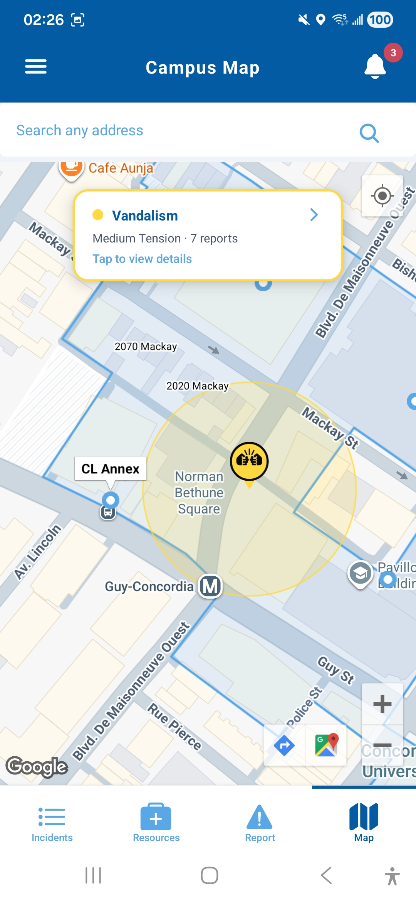
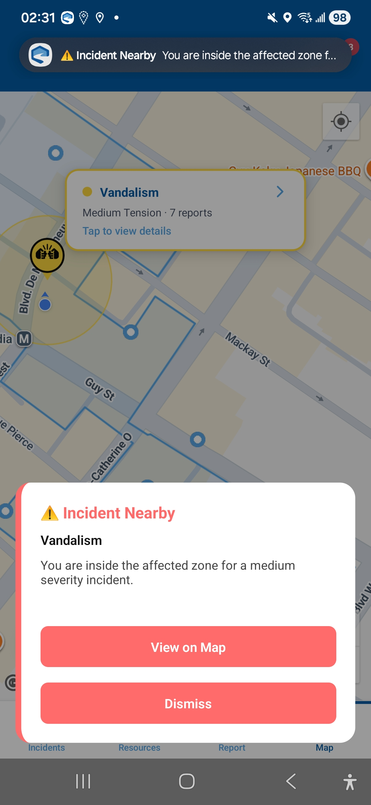
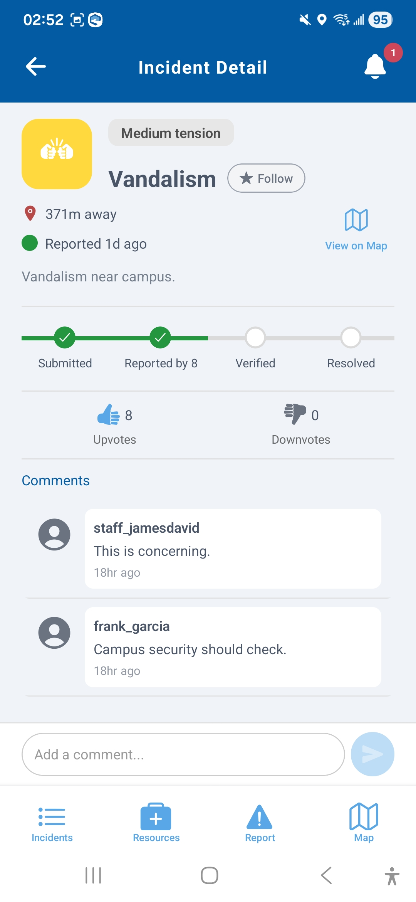
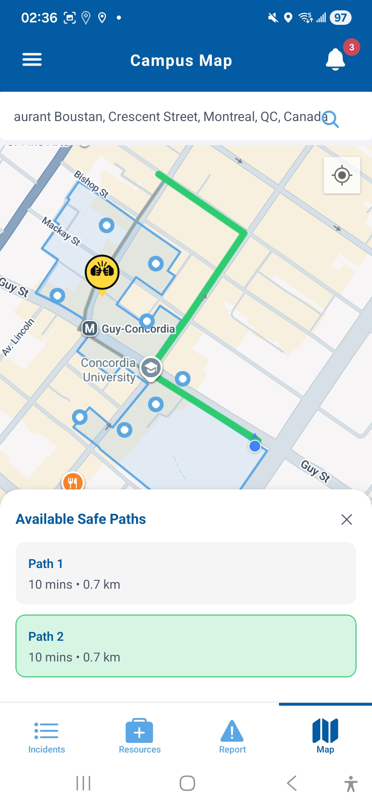
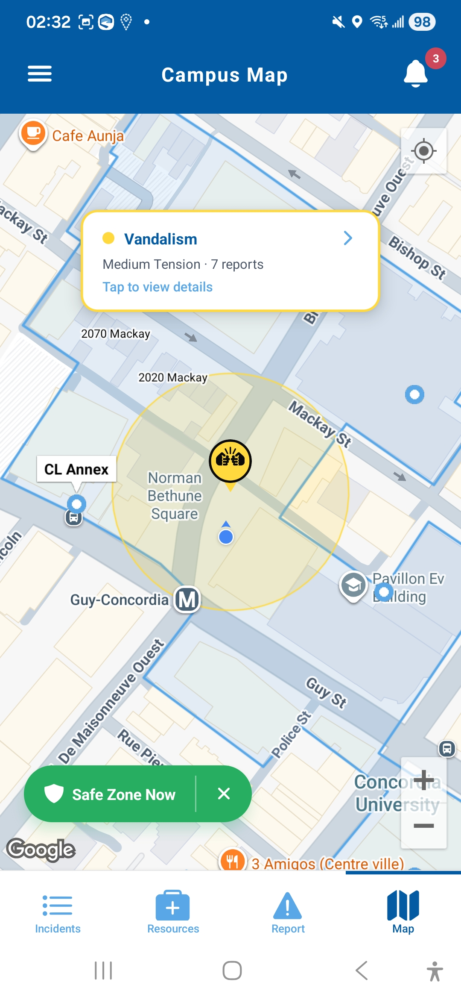
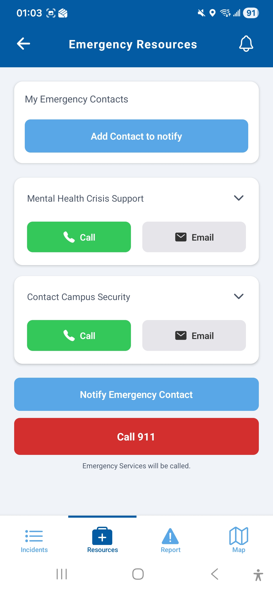

# Concordia Safe Path

A campus safety mobile app for Concordia University students — real-time incident reporting, proximity alerts, and accessible route planning during campus disruptions.

> Built as part of SOEN 6751 (Human-Computer Interaction) at Concordia University, Winter 2026.

---

## Screenshots

<p float="left">
  
  
  
  
  
  
</p>

---
 
## Features
 
- **Live incident map** — see what's happening on campus right now, with color-coded markers and live updates
- **Proximity alerts** — get a heads up as you approach an incident, escalating to a full alert if you enter the affected zone
- **Safe Zone Now** — one tap gets you a route out when you're in a danger zone
- **Crowdsourced reporting** — quickly report an incident by type, severity, and location; upvote or downvote existing ones
- **Emergency resources** — campus security, mental health support, 911, and your personal emergency contacts, all in one place
- **Offline support** — cached data stays visible when you lose connection, so you're never left with a blank screen
- **Role-based accounts** — students and staff see different views and controls depending on their role
- **Accessibility** — built to WCAG AA, with screen reader support, non-color indicators, and sufficient contrast throughout


---

## Tech Stack

| Layer | Technology |
|---|---|
| Framework | React Native + Expo Router |
| Backend | Supabase (PostgreSQL, Auth, Realtime, RLS) |
| Maps | Google Maps SDK via react-native-maps |
| Build | EAS Build |

---

## Team

| Name | Student ID |
|---|---|
| Mary Ann Ng Kwet Pin | 40336644 |
| The-Luan Tran | 40321765 |
| Pirasana Ariyam | 40188773 |
| Honey Sharma | 40292445 |
| Siva Sankar Reddy Veluri | 40162043 |
| Lokesh Kommalapati | 40301947 |

---

## Prerequisites

Make sure you have the following installed before starting:

- [Node.js](https://nodejs.org/) (v18 or higher)
- [Expo CLI](https://docs.expo.dev/get-started/installation/): `npm install -g expo-cli`
- [Git](https://git-scm.com/)
- Either:
  - **Expo Go** app on your physical device ([iOS](https://apps.apple.com/app/expo-go/id982107779) / [Android](https://play.google.com/store/apps/details?id=host.exp.exponent))
  - **Android Emulator** via [Android Studio](https://developer.android.com/studio)
  - **iOS Simulator** via Xcode (macOS only)

---

## Supabase Database Setup

The app requires a Supabase project with the schema defined in `supabase/schema.sql`. Paste the contents of that file into the **Supabase SQL Editor** to set up all tables, RLS policies, and triggers.

---

## Setup

**1. Clone the repository**
```bash
git clone https://github.com/luantran/concordia-safe-path.git
cd concordia-safe-path
```

**2. Install dependencies**
```bash
npm install
```

**3. Set up environment variables**

Create a `.env` file in the project root:
```
EXPO_PUBLIC_SUPABASE_URL=your_supabase_project_url
EXPO_PUBLIC_SUPABASE_KEY=your_supabase_anon_key
```

Get these from your Supabase dashboard:
1. Go to https://supabase.com and open your project
2. The URL on the home page (`https://****.supabase.co`) is your `EXPO_PUBLIC_SUPABASE_URL`
3. Go to **Project Settings → API → Project API keys** and copy the **publishable** key as `EXPO_PUBLIC_SUPABASE_KEY`

**4. Start the app**
```bash
npx expo start
```

Make sure your phone and computer are on the same WiFi network.

---

## Running the App

| Platform | Command | Notes |
|---|---|---|
| Android Emulator | Press `a` in terminal | Emulator must be running first |
| iOS Simulator | Press `i` in terminal | macOS only |
| Physical device | Scan QR code with Expo Go | Must be on same WiFi network |

---

## Project Structure

```
app/
├── (auth)/           ← Login & Register screens
├── (dashboard)/      ← Main app tabs
│   ├── incidents/    ← Incident feed + detail
│   │   ├── index.jsx
│   │   └── [id].jsx
│   ├── create.jsx    ← Report an incident
│   ├── map.jsx       ← Campus map with incident pins
│   └── profile.jsx   ← User profile + logout
├── _layout.jsx       ← Root layout + providers

components/           ← Reusable themed components
contexts/             ← React context (User, Incidents, Theme, Network, NavigationOverride)
hooks/                ← useUser, useIncidents, useProximityAlerts, useSafeZone
lib/                  ← Supabase client
constants/            ← Colors, theme, map styles
```